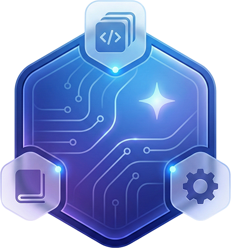
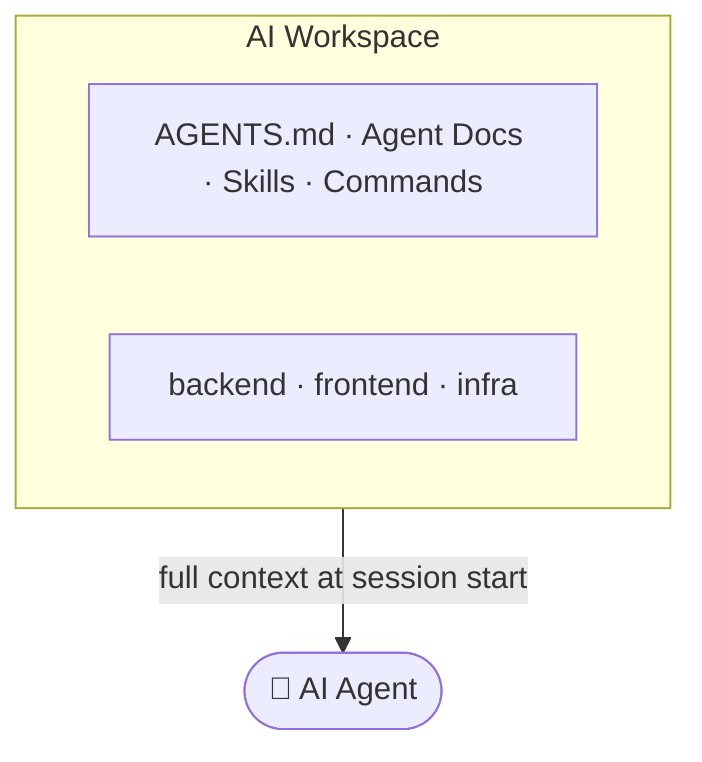

<p align="center">
  <a href="#"></a>
</p>

# AI Workspace Template

A unified, multi-repo workspace for AI coding agents and developers.

Unified instructions, docs, skills, and commands — one source of truth across Claude Code, Cursor, OpenCode, and more.

📖 [**Documentation**](https://michaelyochpaz.github.io/ai-workspace-template/)

## The Problem

AI agents work great inside a single repo. But real projects span multiple repositories, and that's where things break down — agents can't see code in other repos, don't know what branch each one is on, and can't coordinate changes across boundaries. Your AI configuration ends up duplicated and out of sync across tools.



## ✨ Features

- **📂 Cross-repo visibility** — All your repositories live as git submodules in one workspace. Agents see everything.

- **📋 Modular agent docs** — Write focused documentation in `agent-docs/` that agents selectively read based on task relevance. Dozens of docs, minimal token usage.

- **🔍 Tool discovery** — Define CLI tools your team uses (`gh`, `glab`, `jq`, etc.). The workspace detects what's installed and tells agents how to use them — automatically, at session start.

- **⚡ Skills & commands** — Define once in `skills/` and `commands/`, distribute automatically to every AI tool's expected directory. One source of truth.

- **🔄 Auto-generated AGENTS.md** — Your agent instructions, doc listings, and workspace config are merged from templates on every commit. Always in sync, never stale.

- **📊 Repository status** — At session start, agents are told each repo's branch, uncommitted changes, and how far behind the remote. No more "which branch am I on?" confusion.

- **🔁 Runs locally and in CI** — Clone the AI workspace on a developer's laptop or in a CI pipeline — agents will get identical instructions, docs, and tools in a reproducible environment.

- **🗂️ Organized artifacts** — A git-ignored `.tmp/` directory with task-based subdirectories keeps agent-generated files out of your codebase.

## 🛠️ Supported Tools

Session hooks are pre-configured for [Claude Code](https://code.claude.com/), [Cursor](https://cursor.com/), [OpenCode](https://opencode.ai/), and [Gemini CLI](https://geminicli.com/) — they work out of the box with no setup needed.

Any AI tool that reads `AGENTS.md` works with this workspace. Skills and commands can be distributed to any tool by configuring target paths in `ai-workspace.toml`. See the [Configuration](https://michaelyochpaz.github.io/ai-workspace-template/configuration/#distribution) docs for details.

## 🚀 Quick Start

1. Click **"Use this template"** on GitHub to create your workspace repository, or clone it directly if you're using another platform (GitLab, Bitbucket, etc.)

2. Set up:

```bash
uv sync
uv run .ai-workspace/scripts/setup.py
```

3. Add your repos:

```bash
git submodule add <url> repositories/<name>
```

See the [Getting Started](https://michaelyochpaz.github.io/ai-workspace-template/getting-started/) guide for detailed setup instructions.

## 📖 Documentation

Full docs at **[michaelyochpaz.github.io/ai-workspace-template](https://michaelyochpaz.github.io/ai-workspace-template/)**

| Guide | Description |
|-------|-------------|
| [Getting Started](https://michaelyochpaz.github.io/ai-workspace-template/getting-started/) | Setup and first steps |
| [Repositories](https://michaelyochpaz.github.io/ai-workspace-template/repositories/) | Submodule model and status reporting |
| [Configuration](https://michaelyochpaz.github.io/ai-workspace-template/configuration/) | `ai-workspace.toml` reference |
| [Agent Docs](https://michaelyochpaz.github.io/ai-workspace-template/features/agent-docs/) | Writing documentation for agents |
| [Skills](https://michaelyochpaz.github.io/ai-workspace-template/features/skills/) | Distributing agent skills across tools |
| [Commands](https://michaelyochpaz.github.io/ai-workspace-template/features/commands/) | Distributing commands across tools |
| [Tool Discovery](https://michaelyochpaz.github.io/ai-workspace-template/features/tool-discovery/) | CLI tool detection and context injection |
